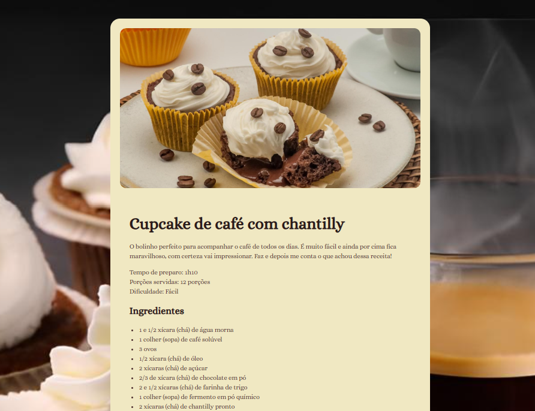

# Página de Receita de CupCake

Simples página feita em HTML e CSS apresentando uma receita de cupcakes. 


## Sobre o projeto:

### 🎮 Funcionalidades:
- Exibição detalhada da receita com ingredientes e modo de preparo.
- Design responsivo para diversos dispositivos.

<br>

### 🛠️ Tecnologias Utilizadas:
- HTML5
- CSS3

<br>

### 🎯 Como Utilizar
1. Clone o repositório:

   ```bash
   git clone https://github.com/usuario/page=CupCake.git
   ```
2. Navegue até o diretório do projeto:
   ```bash
   cd page-CupCake
   ```
3. Abra o arquivo index.html em seu navegador preferido.

<br>


